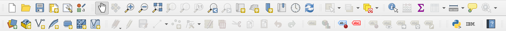
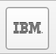
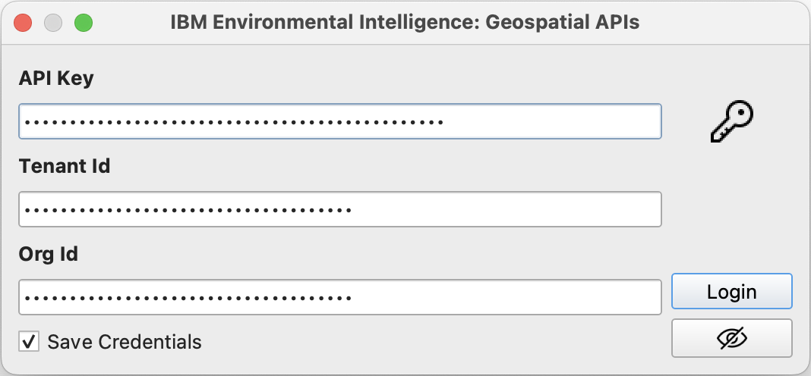
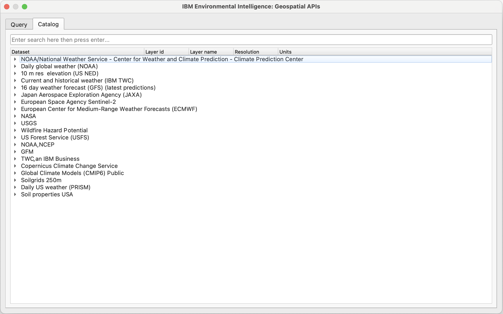
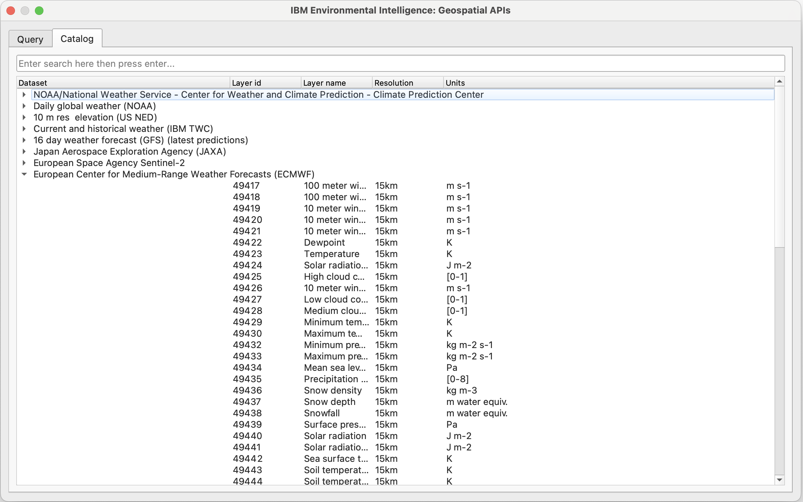
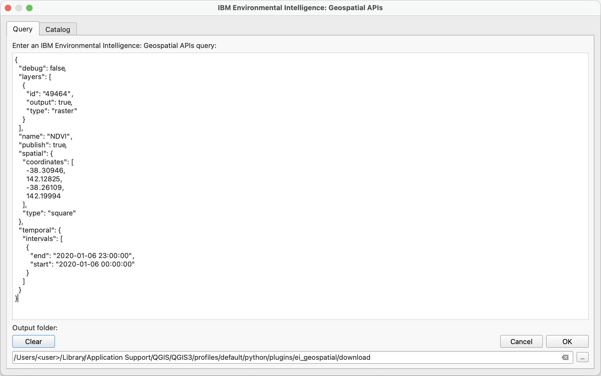
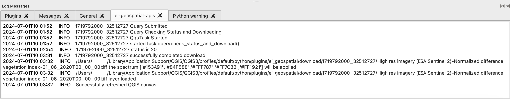
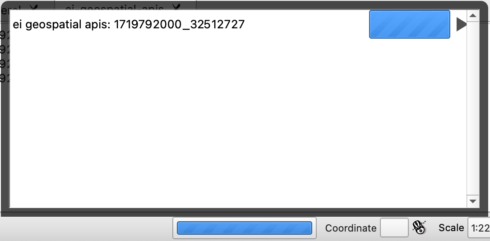
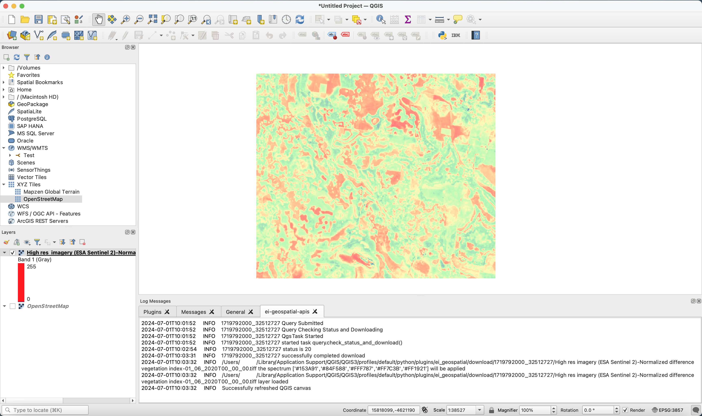

.. _use:

Use
===

Login
-----

Post installation, go to the QGIS toolbar:

	
From the toolbar, you will be able to locate an 'IBM' button that serves as the Toolbar button for the IBM Environmental Intelligence: Geospatial APIs- QGIS Plugin. Click the ``IBM`` button to launch the plugin:

	
The login dialog will appear with prompts for your API Key, Tenant Id and Org Id (see the `official documentation <https://developer.ibm.com/apis/catalog/envintelsuite--ibm-environmental-intelligence/Getting+Started>`_ for details). Fill in your details and click ``login``:
	

.. note::
   The first time you open the plugin you may be prompted for a QGIS credentials manager password. If you wish for QGIS to securely save your credentials enter a master password, otherwise click cancel. 

Catalog
-------

Once logged in, the main dialog with the ``Catalog`` viewer will appear. A ``Data Set`` or ``Data Layer`` can be searched for by using the Search box at the top of the ``Catalog`` viewer (a search request will search the Data Set and Data Layer names as well as the descriptions):

	
The ``Catalog`` viewer can be used to see the data entitlement available to your account (see `Quick Start - Catalog <https://ibm.github.io/ibmpairs/tutorials/quickstart/quickstartcatalog.html>`_ for further details of ``Data Sets`` and ``Data Layers``). When a row for a ``Data Set`` is clicked, metadata details about ``Data Layers`` will appear (``Layer id``, ``Layer name``, ``Resolution``, ``Units``). If a layer is double clicked, its layer Id will be added to the query json in the ``Query`` viewer. 
	

Query
-----

.. note::
	The ``Alpha`` release of the QGIS plugin (versions < 1.0) is restricted to Raster Queries on the v3 API. Use of Point Queries or v4 query json will result in errors.

The ``Query`` viewer can be selected from the tabbed menu at the top of the main Dialog. An IBM Environmental Intelligence: Geospatial APIs query json can be entered within the text box here in order to be run (see `Quick Start - Raster Query <https://ibm.github.io/ibmpairs/tutorials/quickstart/quickstartrasterquery.html>`_). To launch a query; create or copy a valid query json, enter into the text box and click ``OK``.

When a query is launched, the dialog will disappear. A new log messages panel will appear with ``ei-geospatial-apis`` which will contain logged query progress. If you do not have the ``Log Messages`` panel enabled, this can be selected by going to the QGIS ``Menu`` -> ``View`` -> ``Panels`` -> ``Log Messages``.

	
The query executes as a background task. In order to see if the query is complete, from the bottom bar, the progress selector will display a list of background tasks when clicked; the query id returned by IBM Environmental Intelligence: Geospatial APIs will be displayed in the name of the task:

	
This query id can be reused to download the same results again via the (`ibmpairs <https://github.com/IBM/ibmpairs>`_) Python SDK in a Python program, if desired.
	
When complete, the resulting images from a Raster Query will be displayed in the QGIS ``Layers`` left hand menu and enabled in the QGIS Map:
	

	
Further context can be added to the image above by adding a map in the projection ``EPSG:4326`` using the inbuilt XYZ Tiles OpenStreetMap Layer or by using the ``QuickMapServices`` QGIS plugin.
